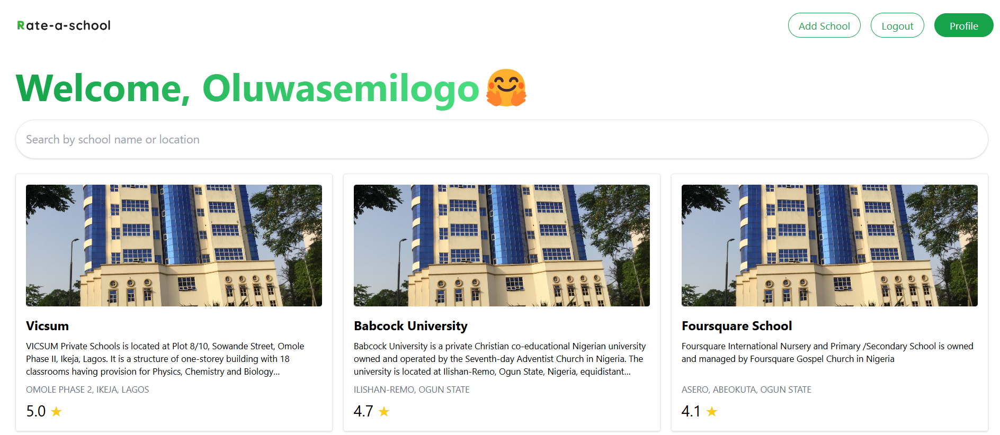

# School Rating and Review Platform

A web application designed to allow users to rate schools and share their experiences, promoting transparency and informed decision-making for parents and guardians. The platform addresses critical issues such as bullying and poor school quality by providing a space for community-driven feedback.

---



---

## Table of Contents

- [Features](#features)
- [Technologies Used](#technologies-used)
- [Installation](#installation)
- [Usage](#usage)
- [API Endpoints](#api-endpoints)
- [Authentication and Security](#authentication-and-security)
- [Contributing](#contributing)
- [License](#license)

---

## Features

- **Rate Schools**: Users can provide ratings for schools.
- **Commenting**: Share feedback and experiences about a particular school.
- **Filtering**: Filter schools by name and location for easy navigation.
- **Secure Authentication**: Ensures data privacy with secure login and token-based authentication.
- **Community-Driven Feedback**: Empowers parents, guardians, and students with actionable insights.

---

## Technologies Used

### Backend

- **Python**
- **Django**: Backend framework.
- **Django REST Framework**: For building REST APIs.
- **JWT Authentication**: Secure token-based authentication.
- **SQLite**: Database.

### Frontend

- **React.js**: For building the user interface.
- **TypeScript**: Ensures type safety in React.
- **Tailwind CSS**: For modern and responsive styling.

---

## Installation

### Clone the repository

```bash
git clone https://github.com/semilogopaul/rateaschool.git
cd rateaschool
```

### Set up the backend

```bash
cd backend
python -m venv env
source env/bin/activate  # For Windows, use 'env\Scripts\activate'
pip install -r requirements.txt
python manage.py migrate
python manage.py runserver
```

### Set up the frontend

```bash
cd frontend
npm install
npm run dev
```

### Access the application

- Backend API: `http://127.0.0.1:8000`
- Frontend: `http://localhost:5173`

---

## Usage

- **Sign up or Log in**: Create an account to access platform features.
- **Search for Schools**: Use the filtering options to search by name or location.
- **Rate and Review**: Share your feedback about a school.
- **View Feedback**: Browse community ratings and reviews for informed decision-making.

---

## API Endpoints

- **Admin**: `/admin/`
- **User Management**: `/api/users/`
- **Schools**: `/api/schools/`
- **Token Refresh**: `/api/token/refresh/`

---

## Authentication and Security

- **JWT Authentication**: Ensures secure login and access control.
- **Data Privacy**: User data is protected with robust security measures.
- **Token Refresh**: Allows users to maintain authentication without logging in repeatedly.

---

## Contributing

We welcome contributions to improve this platform. To contribute:

1. Fork the repository.
2. Create a new branch:

   ```bash
   git checkout -b feature-name
   ```

3. Commit your changes:

   ```bash
   git commit -m "Description of changes"
   ```

4. Push your branch:

   ```bash
   git push origin feature-name
   ```

5. Open a Pull Request.

---
